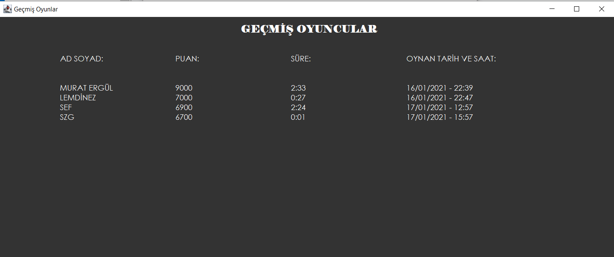

# About Project
I programmed the a "Word Game" on Java console with Java and Java GUI which is very popular TV show game in Turkey. In Word Game you are trying to guess 14 words in limited time. First question's answer is four letter, letter number increase by one every two question.Every character has 100 points. User can demand letters from the program which cause the point lost. The character of words generated randomly when user demands character.

## Introduction

||
|----------|
|Welcome Page|

- In welcome page, there are four option that user can choose. These are Start Game, Game Rules, Add Question, Past Games.

 

## Add Question

||
|----------|
|Add Question|

- There are six groups of words. Users can add questions of four to ten letter answers. According to game rules, answer of first two questions are four letter and it goes up to ten as the question number.

 

## Game Rules

||
|----------|
|Game Rules|

 

## Past Games

||
|----------|
|Game Rules|

 

## Start Game

|||
|----------|-----|
|Start Game|Get letter - Answer Buttons |

- The game will start when you hit red button after you wrote your name. You have a time limit, four minutes. After you pressed red button the timer starts.
- User can get letter of the word. The letter generated randomly from random letter number. 

 

## Answering Question

|||
|----------|-----|
|Answer|Correct Answer|

- For right answers, user will earn points up to the unopened letters of word. (Unopened Letter x 100 = Earned Point).
- If you hit Answer button, timer will stop. User have to guess the word right in 20 seconds. Otherwise the user lost point up to the value of question. It is calculating by 100 points for every letter in answer.

||
|----------|
|Times Up !!|

 

## Results

||
|----------|
|Results|

- At the end of the game, the results screen will be shown in screen. It will show the user name, points and play time.
